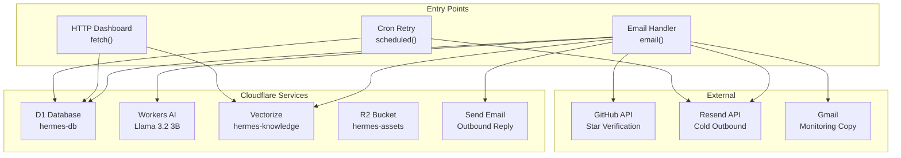
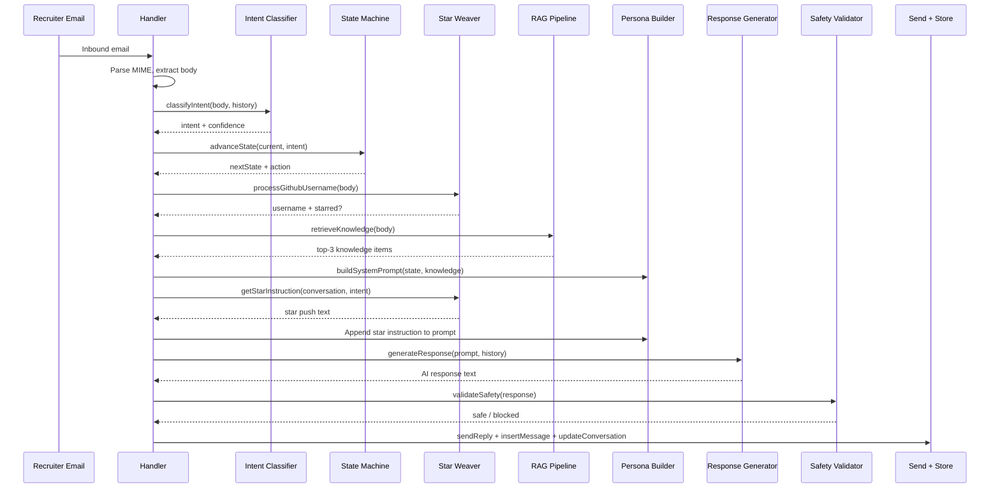
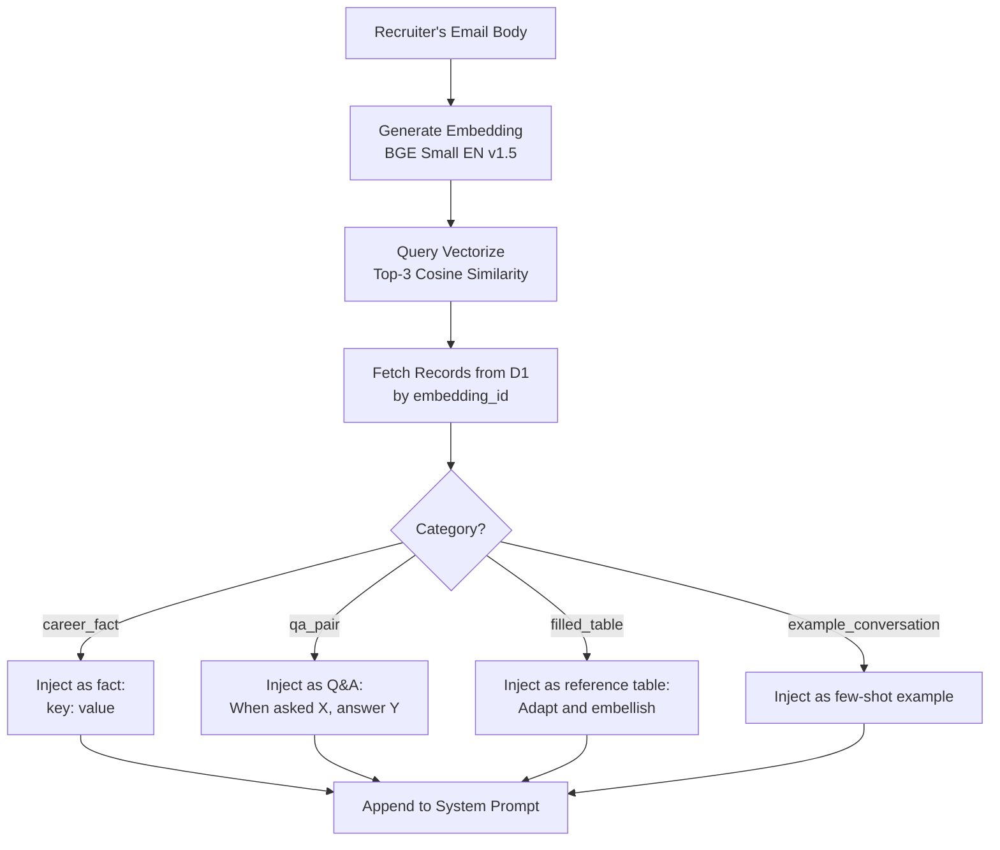
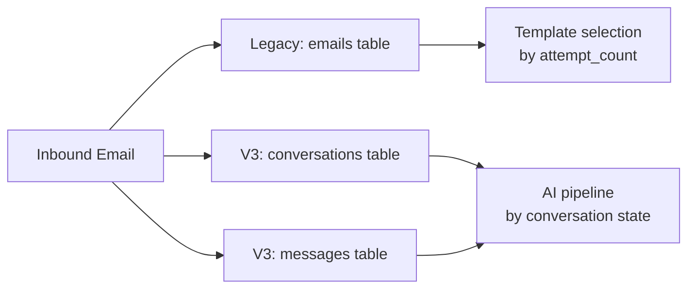

# Architecture

## System Overview

Hermes runs on Cloudflare's edge infrastructure with three entry points and five service bindings.



## AI Response Pipeline

This is the core pipeline that processes every inbound email when AI mode is enabled.



## RAG Pipeline Detail



## Cloudflare Bindings

| Binding | Type | Resource Name | Purpose |
|---------|------|---------------|---------|
| `env.DB` | D1 Database | hermes-db | All persistent data |
| `env.AI` | Workers AI | -- | Llama 3.2 3B + BGE Small |
| `env.KNOWLEDGE_INDEX` | Vectorize | hermes-knowledge | 384-dim cosine index |
| `env.ASSETS` | R2 Bucket | hermes-assets | Static assets |
| `env.SEND` | Send Email | -- | Reply to inbound |

## Database Schema

### conversations

```sql
CREATE TABLE conversations (
    id              INTEGER PRIMARY KEY AUTOINCREMENT,
    sender_email    TEXT NOT NULL,
    sender_name     TEXT,
    sender_domain   TEXT,
    to_address      TEXT,
    channel         TEXT DEFAULT 'direct',    -- direct | forwarded
    subject         TEXT,
    state           TEXT DEFAULT 'INITIAL',
    ai_enabled      INTEGER DEFAULT 0,        -- 0=global, 1=force on, -1=force off
    github_username TEXT,
    star_verified   INTEGER DEFAULT 0,
    job_title       TEXT,
    job_company     TEXT,
    message_count   INTEGER DEFAULT 0,
    created_at      TEXT,
    updated_at      TEXT
);
```

### messages

```sql
CREATE TABLE messages (
    id              INTEGER PRIMARY KEY AUTOINCREMENT,
    conversation_id INTEGER NOT NULL,
    direction       TEXT NOT NULL,             -- inbound | outbound
    body_text       TEXT,
    subject         TEXT,
    message_id      TEXT,
    template_used   TEXT,
    ai_model        TEXT,
    ai_tokens_in    INTEGER,
    ai_tokens_out   INTEGER,
    ai_intent       TEXT,
    send_success    INTEGER DEFAULT 1,
    error_notes     TEXT,
    created_at      TEXT,
    FOREIGN KEY (conversation_id) REFERENCES conversations(id)
);
```

### knowledge_base

```sql
CREATE TABLE knowledge_base (
    id           INTEGER PRIMARY KEY AUTOINCREMENT,
    category     TEXT NOT NULL,               -- career_fact | qa_pair | filled_table | example_conversation
    key          TEXT NOT NULL,
    value        TEXT NOT NULL,
    embedding_id TEXT,                        -- Vectorize vector ID (kb-{id})
    active       INTEGER DEFAULT 1,
    created_at   TEXT,
    updated_at   TEXT
);
```

## Module Map

| Layer | Modules | Purpose |
|-------|---------|---------|
| **Entry** | `index.js` | Routes email, fetch, scheduled |
| **Handlers** | `standard.js`, `forwarded.js`, `retry.js` | Channel-specific email processing |
| **AI Core** | `ai.js`, `ai-responder.js` | Model calls and orchestration |
| **Behavior** | `persona.js`, `state-machine.js`, `star-weaver.js` | Personality, state, star logic |
| **Knowledge** | `rag.js`, `knowledge.js` | RAG retrieval and CRUD |
| **Safety** | `safety.js`, `feature-flags.js` | Validation and rollout control |
| **Data** | `db.js`, `conversations.js` | D1 query layers (legacy + v3) |
| **Email** | `email-parser.js`, `mime.js`, `send.js`, `github.js` | Parse, build, send, verify |
| **Content** | `pii-fabrication.js`, `resume-generator.js`, `assets.js` | Generate fake data and resumes |
| **Dashboard** | `router.js`, `api.js`, `views.js` | Web UI and JSON API |
| **Logging** | `observability.js` | Structured JSON logs |
| **Config** | `config.js` | Templates, address routing |

## AI Models

| Model | ID | Use | Config |
|-------|----|-----|--------|
| Llama 3.2 3B Instruct | `@cf/meta/llama-3.2-3b-instruct` | Chat (intent + generation) | temp 0.1 (intent), 0.7 (gen), max 512 tokens |
| BGE Small EN v1.5 | `@cf/baai/bge-small-en-v1.5` | Embeddings for Vectorize | 384 dimensions, batch up to 100 |

## Dual-Write Pattern

During the v2-to-v3 transition, both table sets are written on every interaction:



The legacy `emails` table will be retired once v3 is fully validated.
