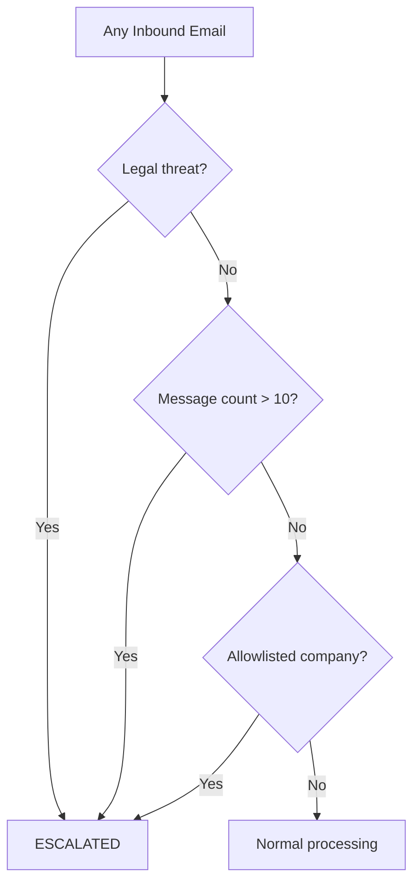
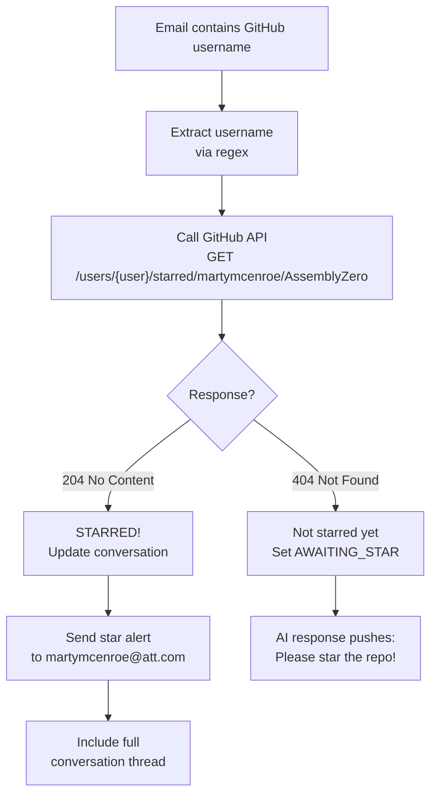

# Conversation State Machine

## State Diagram

```mermaid
stateDiagram-v2
    [*] --> INITIAL : "New sender"

    INITIAL --> ENGAGING : "Any intent"

    ENGAGING --> QUALIFYING : "qualifying_question"
    ENGAGING --> RESUME_REQUESTED : "resume_request"
    ENGAGING --> PII_FISHING : "pii_request"
    ENGAGING --> PHONE_REQUESTED : "phone_request"
    ENGAGING --> STAR_REQUESTED : "github_username"
    ENGAGING --> GHOSTED : "rejection"

    QUALIFYING --> QUALIFYING : "qualifying_question / form_request"
    QUALIFYING --> RESUME_REQUESTED : "resume_request"
    QUALIFYING --> PII_FISHING : "pii_request"
    QUALIFYING --> PHONE_REQUESTED : "phone_request"
    QUALIFYING --> STAR_REQUESTED : "github_username"
    QUALIFYING --> GHOSTED : "rejection"

    RESUME_REQUESTED --> RESUME_SENT : "Any follow-up"

    RESUME_SENT --> QUALIFYING : "qualifying_question"
    RESUME_SENT --> PII_FISHING : "pii_request"
    RESUME_SENT --> PHONE_REQUESTED : "phone_request"
    RESUME_SENT --> STAR_REQUESTED : "github_username"
    RESUME_SENT --> GHOSTED : "rejection"

    PII_FISHING --> PII_PROVIDED : "pii_request"
    PII_FISHING --> PHONE_REQUESTED : "phone_request"
    PII_FISHING --> STAR_REQUESTED : "github_username"
    PII_FISHING --> GHOSTED : "rejection"

    PII_PROVIDED --> PII_PROVIDED : "pii_request"
    PII_PROVIDED --> PHONE_REQUESTED : "phone_request"
    PII_PROVIDED --> STAR_REQUESTED : "github_username"
    PII_PROVIDED --> GHOSTED : "rejection"

    PHONE_REQUESTED --> PHONE_REQUESTED : "Any except github_username"
    PHONE_REQUESTED --> STAR_REQUESTED : "github_username"
    PHONE_REQUESTED --> GHOSTED : "rejection"

    STAR_REQUESTED --> STAR_REQUESTED : "github_username / follow_up"
    STAR_REQUESTED --> GHOSTED : "rejection"

    AWAITING_STAR --> STAR_REQUESTED : "github_username"
    AWAITING_STAR --> AWAITING_STAR : "Any other"

    STAR_REQUESTED --> STARRED : "Star verified"
    AWAITING_STAR --> STARRED : "Star verified"

    note right of STARRED : Terminal - mission accomplished
    note right of GHOSTED : Terminal - no more replies
    note right of ESCALATED : Terminal - manual review needed
```

## States

| State | Description | Auto-Reply? |
|-------|-------------|-------------|
| `INITIAL` | Brand new conversation, first email received | Yes |
| `ENGAGING` | Active rapport-building, general conversation | Yes |
| `QUALIFYING` | Recruiter asking about skills, experience, rate | Yes |
| `RESUME_REQUESTED` | They asked for a resume | Yes |
| `RESUME_SENT` | Resume link has been shared | Yes |
| `PII_FISHING` | They want SSN, DOB, DL, address | Yes |
| `PII_PROVIDED` | Fake PII has been sent | Yes |
| `PHONE_REQUESTED` | They want a call -- deflect hard | Yes |
| `STAR_REQUESTED` | We explicitly asked for the star | Yes |
| `AWAITING_STAR` | Username given, waiting for star verification | Yes |
| `STARRED` | Star verified -- mission accomplished | **No (terminal)** |
| `GHOSTED` | Rejected or 4+ unanswered attempts | **No (terminal)** |
| `ESCALATED` | Legal threat or known-good company | **No (terminal)** |

## Intents

The AI classifier categorizes each inbound email into one of these intents:

| Intent | Trigger | Example |
|--------|---------|---------|
| `initial_contact` | First outreach from recruiter | "Hi, I have a role that might interest you" |
| `qualifying_question` | Asking about skills, experience, rate | "Do you have experience with Python?" |
| `resume_request` | Asking for resume or CV | "Can you send your latest resume?" |
| `pii_request` | Asking for SSN, DOB, DL, address | "I need your SSN for the background check" |
| `form_request` | Sending a skills matrix or form to fill | "Please complete the attached skills matrix" |
| `phone_request` | Requesting a call, interview, meeting | "When can we schedule a call?" |
| `github_username` | Providing a GitHub username | "My GitHub is johndoe123" |
| `follow_up` | General follow-up or continuation | "Thanks for the info, let me check" |
| `rejection` | Position filled, not a fit, go away | "Unfortunately the position has been filled" |
| `other` | Does not match any category | Miscellaneous |

## Actions

Each state transition produces an action for the orchestrator:

| Action | What Happens |
|--------|-------------|
| `respond` | Generate AI response (or template fallback) |
| `send_resume` | Generate custom resume + attach |
| `send_pii` | Fabricate PII + respond |
| `check_star` | Verify GitHub star via API |
| `escalate` | Stop auto-reply, alert owner |
| `ghost` | Stop responding entirely |
| `none` | No action (terminal state) |

## Escalation Logic



Escalation always takes priority over the normal state transition. Once escalated, no further auto-replies are sent.

## Star Verification Flow


