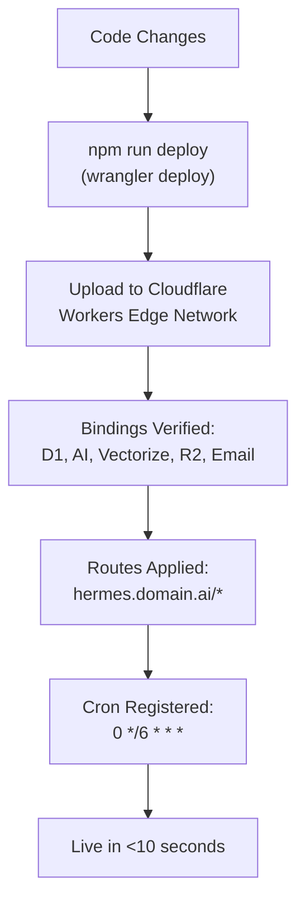
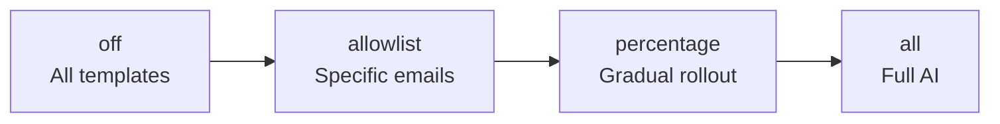

# Deployment

## Prerequisites

- Node.js 18+
- Wrangler CLI: `npm install -g wrangler`
- Cloudflare account with: Workers, D1, R2, Vectorize, Email Routing, Workers AI
- Resend account for cold outbound email

## Initial Setup

### 1. Clone and Install

```bash
git clone https://github.com/martymcenroe/Hermes.git
cd Hermes
npm install
```

### 2. Create Cloudflare Resources

```bash
# D1 Database
wrangler d1 create hermes-db
# Note the database_id and update wrangler.toml

# Vectorize Index
wrangler vectorize create hermes-knowledge --dimensions=384 --metric=cosine

# R2 Bucket
wrangler r2 bucket create hermes-assets
```

### 3. Run Database Migration

```bash
wrangler d1 execute hermes-db --file=schema.sql
```

### 4. Set Secrets

```bash
# AI rollout mode (off | allowlist | percentage | all)
wrangler secret put AI_ROLLOUT_MODE

# Dashboard auth key (hex only, no special chars)
# Generate: openssl rand -hex 32
wrangler secret put DASHBOARD_API_KEY

# Resend API key (for cold outbound from me.forward@ handler)
wrangler secret put RESEND_API_KEY
```

### 5. Configure Email Routing

In Cloudflare Dashboard > Email Routing:

1. Add MX records for your domain
2. Create routing rules:
   - `recruit@yourdomain.ai` -> Worker: hermes
   - `connect@yourdomain.ai` -> Worker: hermes
   - `sell2me@yourdomain.ai` -> Worker: hermes
   - `me.forward@yourdomain.ai` -> Worker: hermes

### 6. Configure DNS (for Dashboard)

In Cloudflare Dashboard > DNS:

| Type | Name | Content | Proxy |
|------|------|---------|-------|
| AAAA | hermes | 100:: | Proxied |

This creates `hermes.yourdomain.ai` pointing to the Worker.

### 7. Deploy

```bash
npm run deploy
```

## Deployment Flow



## Verify Deployment

```bash
# Check dashboard responds
curl -s -o /dev/null -w "%{http_code}" \
  "https://hermes.martymcenroe.ai/?key=YOUR_KEY"
# Expected: 200

# Check stats
curl -s "https://hermes.martymcenroe.ai/api/stats?key=YOUR_KEY" \
  | python3 -m json.tool

# Check live logs
npx wrangler tail --format=json
```

## Rollback

### Via Cloudflare Dashboard

1. Go to Workers > hermes > Deployments
2. Select previous version
3. Click "Rollback"

### Via Git

```bash
git revert HEAD
npm run deploy
```

## Environment Configuration

### wrangler.toml Bindings

```toml
name = "hermes"
main = "src/index.js"
compatibility_date = "2024-01-01"

[triggers]
crons = ["0 */6 * * *"]

routes = [
  { pattern = "hermes.martymcenroe.ai/*", zone_name = "martymcenroe.ai" }
]

[ai]
binding = "AI"

[[d1_databases]]
binding = "DB"
database_name = "hermes-db"
database_id = "your-database-id"

[[r2_buckets]]
binding = "ASSETS"
bucket_name = "hermes-assets"

[[vectorize]]
binding = "KNOWLEDGE_INDEX"
index_name = "hermes-knowledge"

[send_email]
binding = "SEND"
```

### Secrets (not in wrangler.toml)

| Secret | Purpose | Example Value |
|--------|---------|---------------|
| `AI_ROLLOUT_MODE` | Feature flag | `all` |
| `DASHBOARD_API_KEY` | Dashboard auth | `a1b2c3d4...` (hex) |
| `RESEND_API_KEY` | Cold outbound email | `re_...` |
| `AI_ROLLOUT_PERCENT` | For `percentage` mode | `25` |
| `AI_ALLOWLIST` | For `allowlist` mode | `foo@bar.com,baz@qux.com` |

## Feature Flag Rollout



### Switching Modes

```bash
# Templates only
wrangler secret put AI_ROLLOUT_MODE  # Type: off

# Specific senders only
wrangler secret put AI_ROLLOUT_MODE  # Type: allowlist
wrangler secret put AI_ALLOWLIST     # Type: recruiter@example.com,other@test.com

# Gradual rollout
wrangler secret put AI_ROLLOUT_MODE     # Type: percentage
wrangler secret put AI_ROLLOUT_PERCENT  # Type: 25

# Full AI
wrangler secret put AI_ROLLOUT_MODE  # Type: all
```

## Local Development

```bash
npm run dev    # Starts wrangler dev with local D1
```

Note: Local dev uses a local D1 database. Vectorize, R2, and Workers AI require `--remote` flag:

```bash
npx wrangler dev --remote
```

## Database Migrations

Migration files live in `migrations/`:

```bash
# Apply all pending migrations
wrangler d1 migrations apply hermes-db

# Or run a specific SQL file
wrangler d1 execute hermes-db --file=migrations/0002-conversations.sql
```

## Monitoring

### Wrangler Tail (live logs)

```bash
npx wrangler tail --format=json
```

### Key Log Patterns

| Pattern | Meaning |
|---------|---------|
| `Intent: qualifying_question` | Normal classification |
| `State: ENGAGING -> QUALIFYING` | Normal state transition |
| `Safety check failed` | AI generated blocked content -- template fallback |
| `AI generation failed` | Workers AI error -- template fallback |
| `STAR VERIFIED for @username` | Someone starred! Alert sent. |
| `Star alert sent` | Owner email dispatched |
