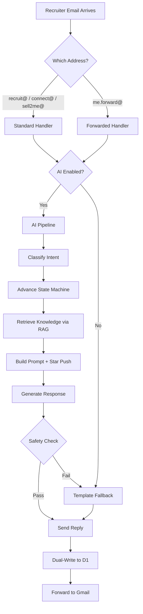

# Hermes Wiki

Hermes is an autonomous AI email agent that handles recruiter outreach, running entirely on Cloudflare Workers. Its single-minded goal is to get every recruiter to star the [AssemblyZero](https://github.com/martymcenroe/AssemblyZero) GitHub repository.

## Pages

| Page | Description |
|------|-------------|
| [[About]] | What Hermes is, why it exists, design philosophy, license |
| [[Architecture]] | System design, component diagram, data flow, module map |
| [[Security]] | Safety rails, PII handling, secret management, incident response |
| [[Conversation-State-Machine]] | States, intents, transitions, escalation triggers |
| [[Knowledge-Base]] | RAG pipeline, categories, management, seeding |
| [[Persona]] | AI personality, behavioral rules, star strategy, phone excuses |
| [[Deployment]] | Setup, deploy, rollback, environment configuration |
| [[API-Reference]] | Dashboard API endpoints and usage |

## Quick Links

| Resource | URL |
|----------|-----|
| Dashboard | `https://hermes.martymcenroe.ai/?key=YOUR_KEY` |
| Runbook | [`docs/runbooks/operations.md`](https://github.com/ThriveTech-AI/Hermes/blob/main/docs/runbooks/operations.md) |
| Wrangler Tail | `npx wrangler tail --format=json` |

## Cost

Estimated $0-5/month on Cloudflare free tiers.

| Service | Free Tier | Estimated Usage |
|---------|-----------|-----------------|
| Workers AI | 10,000 neurons/day | ~74 neurons per recruiter at 5 turns |
| D1 | 5M rows read/day | Well under limit |
| Vectorize | 5M queries/month | Well under limit |
| R2 | 10GB storage | Minimal |
| Workers | 100,000 requests/day | Well under limit |
