# Knowledge Base

The knowledge base powers Hermes's RAG (Retrieval-Augmented Generation) pipeline. It stores facts, answers, tables, and example conversations that the AI retrieves at prompt time to produce accurate, consistent responses.

## How RAG Works

```mermaid
flowchart TD
    subgraph "At Index Time (when you add an entry)"
        A1["New Knowledge Entry<br/>category + key + value"] --> A2["Combine key + value<br/>into single text"]
        A2 --> A3["Generate Embedding<br/>BGE Small EN v1.5<br/>384 dimensions"]
        A3 --> A4["Upsert to Vectorize<br/>ID: kb-{item.id}"]
        A4 --> A5["Store embedding_id<br/>in D1 record"]
    end

    subgraph "At Query Time (when email arrives)"
        B1["Recruiter's Email Body"] --> B2["Generate Embedding<br/>BGE Small EN v1.5"]
        B2 --> B3["Search Vectorize<br/>Cosine Similarity, Top 3"]
        B3 --> B4["Fetch Full Records<br/>from D1 by embedding_id"]
        B4 --> B5["Inject into<br/>System Prompt"]
    end
```



**In plain English:** When you add a knowledge entry, it gets converted to a numerical fingerprint and stored in a searchable index. When a recruiter's email arrives, that email gets the same fingerprint treatment, and the system finds the 3 most similar entries to include in the AI's prompt.

## Categories

| Category | Dashboard Label | Key Field | Value Field |
|----------|----------------|-----------|-------------|
| `career_fact` | Career Fact | Fact name (e.g., "certifications") | Details about that fact |
| `qa_pair` | Q&A Pair | Recruiter's question | Marty's ideal answer |
| `filled_table` | Filled Table | Table name/context | Full table content (skills matrix, form, etc.) |
| `example_conversation` | Example Conversation | Situation name | Full example exchange |

### Career Facts

Facts about Marty that the AI draws from when answering questions. These provide the grounding truth so the AI doesn't have to make everything up.

**Examples:**
- `current_title` -> "Founder and Principal Architect at ThriveTech.ai"
- `certifications` -> "8 AWS certs (including SA Professional, ML Specialty), CISSP, CCSP, PMP, PgMP, PE (Texas), IEEE Senior Member"
- `experience_years` -> "30+ years in technology -- from AT&T Bell Labs (1991) through founding ThriveTech.ai"

### Q&A Pairs

Pre-written answers to common recruiter questions. When the recruiter asks something similar, the RAG system retrieves the matching Q&A and injects it into the prompt.

**Examples:**
- `What is your rate?` -> "Flexible -- depends on the role, expectations, and whether it's W2 or 1099."
- `Can we schedule a call?` -> "My schedule is brutal right now... check out my open source project..."
- `I don't have a GitHub account` -> "No worries! It takes 30 seconds to sign up..."

### Filled Tables

Previously completed skills matrices and forms. When a recruiter sends a similar form, the AI uses these as a baseline -- adapting numbers and adding rows while maintaining consistency.

**Example:** A skills matrix with rows like "Experience in applied Data Science | 12 yrs | Rating 7 | Last 2025"

### Example Conversations

Sample email exchanges that demonstrate desired behavior. These serve as few-shot examples in the prompt, showing the AI how Marty would handle specific situations.

**Examples:**
- `first_response_pattern` -- How to respond to initial outreach with star push
- `condition_parroting_pattern` -- How to parrot back specific conditions
- `resume_request_pattern` -- How to share resume link + pivot to star

## Managing the Knowledge Base

### Via Dashboard

1. Go to `https://hermes.martymcenroe.ai/?key=YOUR_KEY`
2. Scroll to Knowledge Base section
3. Select a category from the dropdown
4. Fill in the fields (labels change per category)
5. Click "Add"
6. To edit: click "Edit" on any entry, modify inline, click "Save"
7. To delete: click "Delete" (soft-delete, sets active=0)

### Via API

```bash
API_KEY="your-key-here"
BASE="https://hermes.martymcenroe.ai"

# List all
curl "$BASE/api/knowledge?key=$API_KEY"

# List by category
curl "$BASE/api/knowledge?category=qa_pair&key=$API_KEY"

# Create
curl -X POST "$BASE/api/knowledge?key=$API_KEY" \
  -H "Content-Type: application/json" \
  -d '{"category":"qa_pair","key":"What is your rate?","value":"Flexible"}'

# Update
curl -X PUT "$BASE/api/knowledge/42?key=$API_KEY" \
  -H "Content-Type: application/json" \
  -d '{"value":"Updated answer text"}'

# Delete
curl -X DELETE "$BASE/api/knowledge/42?key=$API_KEY"

# Import a filled table
curl -X POST "$BASE/api/knowledge/import-table?key=$API_KEY" \
  -H "Content-Type: application/json" \
  -d '{"name":"Table Name","table":"Row1 | Col1 | Col2\nRow2 | Col1 | Col2"}'
```

## Content Rules

1. **ASCII only** -- no em dashes, smart quotes, or Unicode. Use `--` instead of special dashes.
2. **No real PII** -- never store actual SSN, DOB, or sensitive personal data.
3. **Conversational tone** -- write answers as Marty would say them, not as formal documentation.
4. **Keep it concise** -- the AI prompt has a token budget. Short, punchy entries work better than essays.

## Vectorize Indexing

New entries added via the dashboard API are stored in D1 but may not be automatically indexed in Vectorize. To ensure RAG retrieval works:

1. Entries added via the seed script (`tools/seed-knowledge.js`) are automatically indexed
2. Entries added via the API need to be indexed separately
3. Check if an entry has an `embedding_id` -- if null, it's not in Vectorize yet

## Syncing from Career Repo

The `martymcenroe/career` repository contains a `knowledge/` directory with master career data files. A GitHub Action can be configured to automatically sync updates to the Hermes knowledge base when career data changes.

Files synced:
- `knowledge/accomplishments.md` -> career_fact entries
- `knowledge/certifications.md` -> career_fact entries
- `knowledge/narrative.md` -> qa_pair + career_fact entries
- `knowledge/projects.md` -> career_fact entries
- `knowledge/resume-guide.md` -> career_fact entries (technology accuracy rules)
