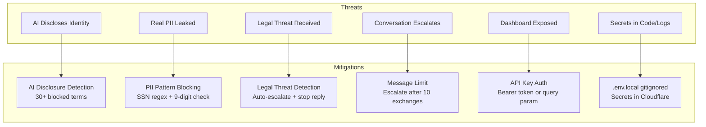
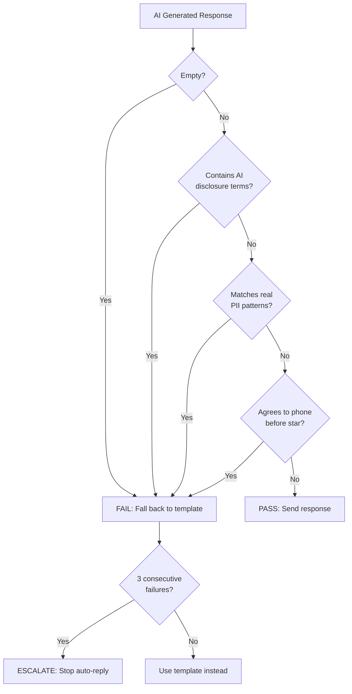
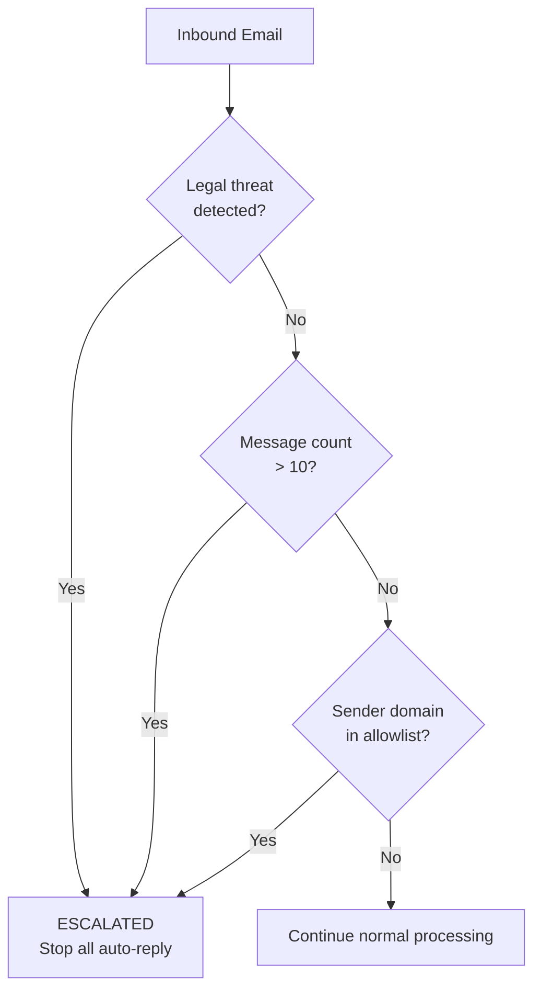

# Security & Safety

## Threat Model



## Safety Rails

### Response Validation Flow

Every AI-generated response passes through safety validation before sending.



### AI Disclosure Terms (blocked)

The following terms in an AI response trigger safety failure:

| Category | Blocked Phrases |
|----------|----------------|
| Direct disclosure | "i am an ai", "i'm an ai", "as an ai" |
| Technical terms | "language model", "large language model", "llm" |
| Product names | "chatgpt", "openai", "claude", "anthropic" |
| Generic terms | "artificial intelligence", "automated response", "automated system" |
| Bot references | "i am a bot", "i'm a bot", "i'm not a real person" |
| Meta references | "generated by", "programmed to", "i don't actually exist" |

### Real PII Detection

| Pattern | Regex | What It Catches |
|---------|-------|-----------------|
| Full SSN | `\d{3}-\d{2}-\d{4}` | 123-45-6789 format |
| Unformatted SSN | `\d{9}` | Nine consecutive digits |

### Phone Agreement Detection

If `star_verified = false`, these phrases are blocked:

- "call you at", "i'll call", "let's schedule a call"
- "available for a call", "here's my number"
- "my phone number", "call me at"

## Escalation System



### Legal Threat Terms

lawyer, attorney, legal action, lawsuit, litigation, cease and desist, subpoena, court order, legal counsel, sue you, take legal, filing a complaint, report you, FTC, federal trade commission

### Company Allowlist (real opportunities)

Google, Microsoft, Apple, Amazon, Meta, Netflix, Stripe, Cloudflare, GitHub, OpenAI, Anthropic

These trigger escalation because they might be real opportunities that deserve manual attention.

## PII Fabrication

When recruiters ask for personal information, Hermes generates **fake but deterministic** data seeded by conversation ID.

| Field | Generation Method | Example |
|-------|-------------------|---------|
| SSN last 4 | `conversationId * prime % 10000` | 7842 |
| Full SSN | Three seeded segments | 483-29-7842 |
| Date of Birth | Random year 1985-1995, month, day | 03/17/1991 |
| Address | Pool of 12 fake addresses | 1247 Oak Ridge Blvd |
| City/State | Pool of 12 city/state pairs | Austin, TX 78704 |
| DL Number | State prefix + 7 digits | TX-2847193 |

**Why deterministic?** If a recruiter asks twice, they get the same answers. Consistency prevents suspicion.

**What is NEVER sent:** Real SSN, real DOB, real address, real DL numbers of the owner.

## Dashboard Security

### Authentication

- **Bearer token**: `Authorization: Bearer YOUR_KEY`
- **Query param**: `?key=YOUR_KEY` (browser access)
- **No key set**: Dashboard is open (dev mode only -- never in production)

### Key Requirements

- **Hex-only** characters (a-f, 0-9) -- special characters (+, /, =) get URL-mangled
- **32 bytes** minimum: `openssl rand -hex 32`
- Stored as **Cloudflare secret** (encrypted at rest)
- Local copy in `.env.local` (gitignored)

## Secret Management

| Secret | Risk If Leaked | Rotation |
|--------|---------------|----------|
| `DASHBOARD_API_KEY` | Full conversation + KB access | `wrangler secret put DASHBOARD_API_KEY` |
| `RESEND_API_KEY` | Can send email as martymcenroe.ai | Rotate in Resend dashboard |
| `AI_ROLLOUT_MODE` | Configuration only (low risk) | `wrangler secret put AI_ROLLOUT_MODE` |

## Kill Switches

### Disable AI (keep templates)

```bash
wrangler secret put AI_ROLLOUT_MODE
# Type: off
```

### Stop ALL email processing

Disable email routing rules in Cloudflare Dashboard > Email Routing.

### Ghost a specific conversation

```bash
wrangler d1 execute hermes-db --command "UPDATE conversations SET state = 'GHOSTED' WHERE id = 123"
```

## Prompt Injection Defense

The system prompt structure isolates untrusted content:

```
[SYSTEM PROMPT - hardcoded persona rules]
[STATE INSTRUCTIONS - from code, not user input]
[KNOWLEDGE BASE - curated by owner, from D1]
[STAR PUSH - from code logic]
---
[USER MESSAGE - recruiter's email body]   <-- Only untrusted content
[ASSISTANT - previous AI responses]
[USER MESSAGE - latest email]             <-- Only untrusted content
```

The recruiter's email is always in the `user` role. It is never injected into the system prompt. Knowledge base entries are curated by the owner through the dashboard.
